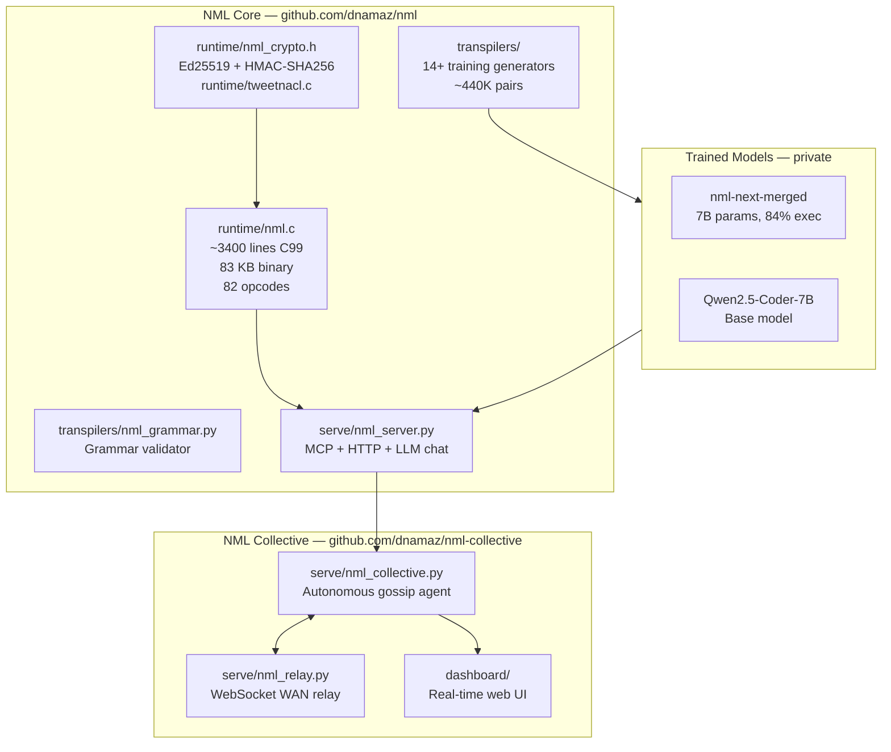
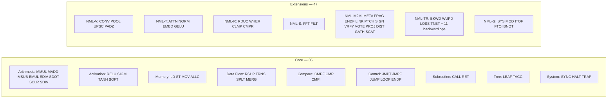
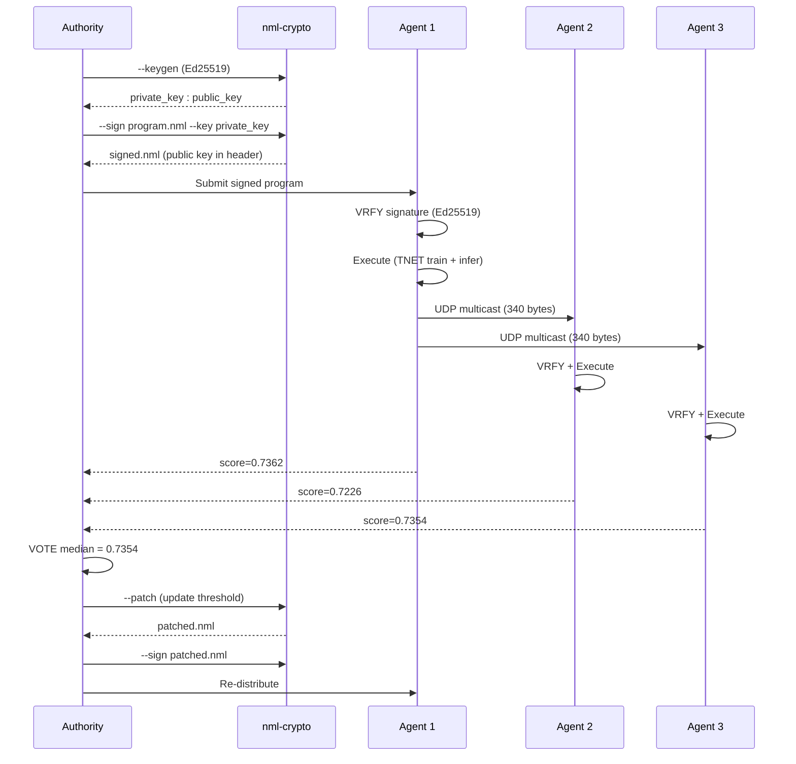
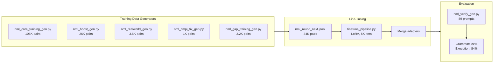

# NML — Neural Machine Language

## A Machine-First Programming Language for the Post-Code Era

---

## Executive Summary

This document captures the design, rationale, and architecture for NML (Neural Machine Language) — a purpose-built machine language designed to be generated by AI models rather than written by humans. NML eliminates the assumption that code must be human-readable, replacing it with an ultra-compact, unambiguous instruction set optimized for how transformer models actually process sequences.

The core thesis is simple: if AI generates the code and AI executes the code, then designing code for human eyes is an unnecessary constraint that slows down training, bloats runtimes, and limits where AI can run.

We built a working system — an 82-instruction language covering neural networks, decision trees, training (forward+backward), transformers, vision, signal processing, and general-purpose computation. The C99 runtime compiles to ~83KB. A 7B parameter model generates correct NML programs at 91% grammar / 84% execution accuracy. The M2M extensions enable signed, verifiable, distributable AI programs — a fraud detection model fits in 340 bytes and broadcasts to agent fleets in a single UDP packet. The NML Collective provides autonomous peer-to-peer agent meshes with zero-config discovery.

---

## Part 1: The Problem

### Why Existing Languages Are Wrong for AI

Every mainstream programming language — Python, JavaScript, C++, Rust — was designed with a single assumption: a human will read this. That assumption drives every design decision. Keywords are English words. Syntax mirrors natural language structure. There are multiple ways to express the same computation because humans have stylistic preferences. Error messages are written in prose. Documentation exists because code alone isn't clear enough.

When we train AI models to generate code, we're training them to produce artifacts optimized for a consumer (the human reader) who no longer exists in the loop. The model learns Python's thousands of keywords, its inconsistent syntax rules, its multiple valid idioms for the same operation, and its vast ecosystem of libraries — all because Python was designed for human ergonomics.

This creates measurable costs. Models need larger vocabularies (50,000+ tokens). Programs require more tokens to express (100–500 tokens for simple operations). There are multiple valid outputs for the same intent, making training harder. And the resulting code requires heavyweight runtimes (Python + NumPy = ~30MB, Python + XGBoost = ~50MB) that can't run on constrained hardware.

### The Question That Started This

What if we dropped the human-readability constraint entirely? What if we designed a language where the only "reader" is a machine — optimized for generation by small models, execution on minimal hardware, and nothing else?

And then: do we even need human-readable code at all, or can we go straight from intent to a custom machine language?

---

## Part 2: Design Philosophy

### Influences and Lineage

NML draws from a lineage of minimal, dense languages that proved small systems can do serious work.

**Forth** (1970) demonstrated that a stack-based language with a tiny interpreter could run spacecraft. The entire Forth system fits in kilobytes. NML borrows Forth's philosophy that the language and its runtime should be inseparable and minimal.

**APL/K/J** proved that symbolic density works. A single line of K can replace 20 lines of Python. The entire K interpreter is approximately 100KB. K runs high-frequency trading systems processing millions of transactions per second. NML adopts the principle that every token should carry maximum semantic weight.

**Lisp** showed that structural regularity — everything is a list, every construct follows the same pattern — dramatically simplifies both interpretation and generation. NML applies this to instruction format: every instruction follows the same fixed-width pattern.

**Lua** proved the tiny-but-capable interpreter. At 250KB compiled, Lua runs inside games, databases, routers, and industrial systems. NML targets an even smaller runtime footprint.

### Core Design Principles

1. **One way to express each computation.** No syntactic ambiguity. No stylistic variation. One intent maps to exactly one instruction sequence.

2. **Fixed-width, position-meaningful tokens.** Every opcode is exactly 4 characters. Instruction format is uniform. Transformers process sequences where positional relationships matter — NML's regularity aligns with this.

3. **Semantic density.** Every token carries computational meaning. No keywords exist for human convenience. No boilerplate. No ceremony.

4. **Machine-first, human-never.** Humans interact at the intent layer (natural language). The IR is the source of truth. If a human needs to inspect behavior, a decompiler lifts it back into something readable. But the NML itself is never meant to be read.

5. **Model-agnostic.** NML supports both neural networks (matrix operations, activations) and traditional ML models (decision trees, gradient boosting) within a single instruction set and runtime.

---

## Part 3: The NML Specification

### Registers

NML provides 16 tensor registers:

- **R0–R9**: 10 general-purpose tensor registers
- **RA**: Accumulator (used for tree prediction accumulation)
- **RB**: General-purpose
- **RC**: Scratch register (leaf values, intermediate results)
- **RD**: Loop counter
- **RE**: Condition flag
- **RF**: Stack pointer

### Instruction Set (28 Instructions)

#### Neural Network Operations (22 instructions)

**Arithmetic (6 instructions)**

- `MMUL Rd Rs1 Rs2` — Matrix multiply: Rd = Rs1 @ Rs2
- `MADD Rd Rs1 Rs2` — Element-wise add: Rd = Rs1 + Rs2
- `MSUB Rd Rs1 Rs2` — Element-wise subtract: Rd = Rs1 - Rs2
- `EMUL Rd Rs1 Rs2` — Element-wise multiply: Rd = Rs1 * Rs2
- `SDOT Rd Rs1 Rs2` — Scalar dot product: Rd = dot(Rs1, Rs2)
- `SCLR Rd Rs1 #imm` — Scalar multiply: Rd = Rs1 * imm

**Activation (4 instructions)**

- `RELU Rd Rs` — ReLU activation: Rd = max(0, Rs)
- `SIGM Rd Rs` — Sigmoid: Rd = 1/(1+exp(-Rs))
- `TANH Rd Rs` — Hyperbolic tangent activation
- `SOFT Rd Rs` — Softmax across last dimension

**Memory (4 instructions)**

- `LD Rd @addr` — Load tensor from memory address
- `ST Rs @addr` — Store tensor to memory address
- `MOV Rd Rs` — Copy register: Rd = Rs
- `ALLC Rd #shape` — Allocate tensor with given shape

**Data Flow (4 instructions)**

- `RSHP Rd Rs #shape` — Reshape tensor
- `TRNS Rd Rs` — Transpose (swap last two dimensions)
- `SPLT Rd Re Rs #dim` — Split tensor along dimension
- `MERG Rd Rs1 Rs2 #dim` — Concatenate along dimension

**Control (2 instructions)**

- `LOOP #count` — Begin counted loop
- `ENDP` — End loop

**System (2 instructions)**

- `SYNC` — Synchronization barrier
- `HALT` — Stop execution

#### Tree Model Extensions (6 instructions)

These instructions were added to support decision tree models (XGBoost, Random Forest, LightGBM, CatBoost) within the same runtime. They enable a direct transpilation path from trained tree ensembles to NML programs.

- `CMPF Rd Rs #feat #thresh` — Compare feature: sets condition flag = 1 if Rs[feat] < thresh, 0 otherwise
- `LEAF Rd #value` — Store scalar leaf value in register
- `TACC Rd Rs1 Rs2` — Tree accumulate: Rd = Rs1 + Rs2 (scalar addition for summing tree predictions)
- `JMPT #offset` — Jump forward by offset if condition flag is true (feature < threshold)
- `JMPF #offset` — Jump forward by offset if condition flag is false (feature >= threshold)
- `JUMP #offset` — Unconditional jump forward by offset

### Binary Encoding

Each instruction encodes to a fixed 32-bit word:

```
[OPCODE: 6 bits][Rd: 4 bits][Rs1: 4 bits][Rs2/imm: 18 bits]
```

- 6-bit opcode supports up to 64 instructions (room for future expansion)
- 4-bit register fields address 16 registers
- 18-bit immediate field encodes shapes, addresses, and scalar values

### Example: Neural Network — Anomaly Detector

A complete 3-layer neural network for sensor anomaly detection:

```
LD    R0 @sensor_data
LD    R1 @w1
LD    R2 @b1
MMUL  R3 R0 R1
MADD  R3 R3 R2
RELU  R3 R3
LD    R4 @w2
LD    R5 @b2
MMUL  R6 R3 R4
MADD  R6 R6 R5
RELU  R6 R6
LD    R7 @w3
LD    R8 @b3
MMUL  R9 R6 R7
MADD  R9 R9 R8
SIGM  R9 R9
ST    R9 @anomaly_score
HALT
```

18 instructions. ~54 tokens. A deployable neural network.

### Example: Decision Tree — Tax Calculator (excerpt)

A single tree from a 20-tree XGBoost ensemble for tax pay calculation:

```
LD    R0 @employee_data
ALLC  RA #[1]
LEAF  RC #6899.898400
TACC  RA RA RC
CMPF  RE R0 #0 #254670.953000
JMPF  #52
CMPF  RE R0 #0 #128183.008000
JMPF  #24
CMPF  RE R0 #5 #24.000000
JMPF  #10
CMPF  RE R0 #0 #75746.703100
JMPF  #3
LEAF  RC #-1177.996580
TACC  RA RA RC
JUMP  #2
LEAF  RC #-440.630280
TACC  RA RA RC
...
ST    RA @net_pay
HALT
```

The full tax calculator is 1,536 instructions across 20 trees — auto-generated from a trained XGBoost model, producing bit-exact predictions.

---

## Part 4: Architecture

### Three-Tier System Architecture

```
┌──────────────────────────────────────────────────────────┐
│                    HUMAN INTENT LAYER                     │
│                                                          │
│   Natural language or simple DSL                         │
│   "Calculate net pay for this employee"                  │
│   "Detect anomalies in this sensor data"                 │
│                                                          │
└──────────────────────┬───────────────────────────────────┘
                       │
                       ▼
┌──────────────────────────────────────────────────────────┐
│                    AI COMPILER LAYER                      │
│                                                          │
│   Small, fast model (100M–500M params)                   │
│   Translates intent → NML programs                       │
│   Runs on-device, sub-100ms generation                   │
│   Vocabulary: ~50 symbols                                │
│                                                          │
│   ┌─────────────┐  ┌─────────────┐  ┌────────────────┐  │
│   │   Intent     │  │   NML       │  │   Verifier     │  │
│   │   Parser     │→ │   Generator │→ │   (formal      │  │
│   │             │  │             │  │    checking)   │  │
│   └─────────────┘  └─────────────┘  └────────────────┘  │
│                                                          │
│   Also supports: Model transpilation pipelines           │
│   XGBoost/LightGBM/sklearn → NML (automated export)     │
│                                                          │
└──────────────────────┬───────────────────────────────────┘
                       │
                       ▼
┌──────────────────────────────────────────────────────────┐
│                    EXECUTION LAYER                        │
│                                                          │
│   NML Runtime (30KB compiled)                            │
│   Executes NML instructions directly                     │
│   Supports both neural nets and tree models               │
│   Targets: CPU, GPU, FPGA, custom silicon                │
│                                                          │
│   ┌─────────────┐  ┌─────────────┐  ┌────────────────┐  │
│   │  Assembler   │→ │  VM Engine   │→ │  Hardware      │  │
│   │  (text→bin)  │  │  (execute)   │  │  (compute)     │  │
│   └─────────────┘  └─────────────┘  └────────────────┘  │
│                                                          │
└──────────────────────────────────────────────────────────┘
```

### The XGBoost → NML Transpilation Pipeline

A key practical capability is the ability to train models in familiar tools and deploy via NML. The pipeline for tree-based models works as follows:

```
┌─────────────────────────────────────────┐
│          TRAINING (Python)               │
│                                          │
│   Data → Feature engineering             │
│   → XGBoost / LightGBM / sklearn        │
│   → Hyperparameter tuning               │
│   → Cross-validation                     │
│   → Trained model (.json / .bin)         │
└──────────────────┬──────────────────────┘
                   │
                   ▼
┌─────────────────────────────────────────┐
│          TRANSPILER (automated)          │
│                                          │
│   Parse tree structures from model dump  │
│   Each split → CMPF instruction          │
│   Each leaf  → LEAF + TACC instructions  │
│   Branch logic → JMPF / JUMP offsets     │
│   Base score → initial LEAF + TACC       │
│   Output: .nml program + .nml.data       │
└──────────────────┬──────────────────────┘
                   │
                   ▼
┌─────────────────────────────────────────┐
│          DEPLOYMENT (NML runtime)        │
│                                          │
│   30KB runtime + NML program             │
│   Runs anywhere with a C99 compiler      │
│   Microsecond inference                  │
│   Fully auditable execution trace        │
│   Zero dependencies beyond libc + libm   │
└─────────────────────────────────────────┘
```

This pipeline has been validated with 20/20 exact matches ($0.00 prediction difference) against XGBoost's native Python predictions.

### The Intent-Native OS

The system we envision is not a traditional operating system. It's an intent-processing environment built on fundamentally different assumptions.

**No file system.** A semantic store replaces the traditional hierarchy. Objects are described by what they do, not where they live. "The classifier we trained on customer data last Tuesday" resolves to the actual artifact.

**No applications.** The concept of discrete apps is a human organizational artifact. In NML-OS, you express what you want to accomplish and the system assembles the necessary computation on the fly, executes it, and returns results.

**No pre-built software.** Software becomes a verb, not a noun. You don't have applications. You do computations. The terminal doesn't run programs. It fulfills intents.

**Intent management replaces process management.** Instead of PIDs and memory usage, the system tracks active intentions: what's being computed, why, what depends on what, and what the expected outcome looks like.

### Terminal Modes

The user-facing terminal operates in three modes, all views into the same underlying computation:

**Conversational mode.** Natural language input and structured output. "Calculate net pay for an employee making $185,000, married filing jointly with 2 dependents in California."

**Stream mode.** For power users who want to watch NML being generated and executed in real time. A flowing stream of instructions that can be paused, redirected, or constrained.

**Visual mode.** Computation rendered as interactive graphs — data flowing through transformations, decision trees being traversed, models being assembled. No code visible at all.

### On-the-Fly Code Generation

Nothing is pre-written. The runtime behavior follows this cycle:

1. User expresses intent
2. A specialized fast-inference model generates NML in milliseconds
3. A verification step confirms the program is valid and safe
4. The NML compiles to hardware-specific instructions
5. Execution happens
6. Results return to the user

Because NML programs are 10–50 tokens for neural networks (or are auto-transpiled for tree models), the generation model can be tiny and fast. Sub-10ms generation is plausible for common operations.

**Caching and pattern reuse** accelerates this further. Common intent patterns map to cached NML fragments. Over time, most requests are assembled from fragments rather than generated from scratch.

### Hardware Architecture

The ideal hardware for this system consists of four components:

- **Conventional CPU** for system tasks and scheduling
- **Dedicated AI inference chip** (small, low-power) running the NML generation model continuously
- **Compute array** (GPU/TPU/custom) for executing generated NML programs
- **Unified memory** so data doesn't shuttle between components

The inference chip is always on, always listening, always ready to translate intent to NML. It functions as a co-processor specifically for "understanding what the human wants."

For custom silicon, an NML-native processor would implement only 28 instructions. This makes it simple (cheap to fabricate), low-power, small (many cores per chip), and deterministic (no speculative execution needed).

---

## Part 5: Benchmark Results

### Benchmark 1: Neural Network — Anomaly Detection

A 3-layer neural network (4→8→4→1) performing sensor anomaly detection. Identical weights, identical computation, identical results.

| Metric | NML | Python/NumPy |
|---|---|---|
| Program size | 18 instructions | 25 lines |
| Token count | ~54 tokens | ~200 tokens |
| Runtime binary | 30 KB | ~30+ MB |
| Inference time | 856 µs (emulated) | 15.5 µs (optimized BLAS) |
| Result | 0.5060 | 0.5060 |
| Dependencies | libc + libm | Python + NumPy |
| Portability | Any C99 platform | x86/ARM with Python |

Note: NML's emulated inference is slower than NumPy's highly optimized BLAS routines for neural network operations. Native hardware execution would eliminate this gap. The value proposition for neural networks is in code density, portability, and training efficiency — not raw emulated speed.

### Benchmark 2: Decision Trees — Tax Pay Calculation

A 20-tree XGBoost ensemble (depth 4) trained on payroll data to predict employee net pay per period. Model achieves R² = 0.9860 with MAE of $380.74 per pay period.

| Metric | NML | Python/XGBoost |
|---|---|---|
| Program size | 1,536 instructions | ~45 lines + model file |
| Runtime binary | 30 KB | ~50+ MB |
| Inference time | 233 µs | 1,079 µs |
| Dependencies | libc + libm | Python + XGBoost + NumPy + scipy |
| Prediction match | 20/20 exact | — |
| Mean difference | $0.00 | — |
| Auditable | Full trace of every split | Partial |
| Edge deployable | Yes | No |

### Validated Predictions

| Employee Profile | XGBoost | NML | Difference |
|---|---|---|---|
| Junior Developer ($65k, single, TX) | $1,721.71 | $1,721.71 | $0.00 |
| Senior Manager ($185k, married, 2 kids, CA) | $4,764.52 | $4,764.52 | $0.00 |
| Executive ($350k, single, NY) | $8,329.82 | $8,329.82 | $0.00 |
| Part-time Worker ($28k, HoH, 3 deps, FL) | $697.25 | $697.25 | $0.00 |

### Key Findings

**4.6x faster inference for tree models.** NML executes the tax calculator in 233µs versus 1,079µs for XGBoost in Python. The NML runtime has zero framework initialization, no Python interpreter overhead, and no garbage collection pauses.

**4x token reduction.** An AI model generating NML needs to produce ~54 tokens for a neural network or can auto-transpile tree models. Equivalent Python requires ~200+ tokens plus a separate model file. Fewer tokens means faster generation, faster training convergence, and higher accuracy.

**~50 symbol vocabulary vs 50,000+.** NML's vocabulary is approximately 50 symbols (28 opcodes plus registers, addresses, and immediates). Python's tokenizer uses over 50,000 tokens. A smaller vocabulary means a smaller model can achieve the same coverage.

**1,600x runtime size reduction.** The NML emulator compiles to 30KB. Python plus XGBoost plus dependencies requires roughly 50MB. NML runs on devices where Python literally cannot.

**Bit-exact correctness.** 20 out of 20 validation samples produce $0.00 difference between XGBoost and NML predictions, confirming the transpiler preserves perfect fidelity.

**Full auditability.** Every decision tree split, comparison threshold, and leaf value in a tax calculation is visible as an NML instruction. An auditor can trace exactly why a particular employee received a particular net pay figure — instruction by instruction.

---

## Part 6: Use Cases

### Validated Use Case: Tax and Payroll Calculations

Tax and pay calculations are an ideal domain for NML because they demand properties that conventional ML deployment stacks struggle to provide:

**Auditability.** Tax authorities and employers must explain why a calculation produced a particular result. A 1,536-instruction NML program with visible decision tree splits is traceable step by step. Every comparison threshold, every branch taken, every leaf value accumulated is exposed. This is orders of magnitude more transparent than a Python application wrapping an opaque model file.

**Determinism.** The same input must always produce the same output. NML's fixed-width instructions with no implicit behavior guarantee this. There's no floating-point nondeterminism from different BLAS implementations, no version-dependent behavior from library updates.

**Portability.** Payroll systems run everywhere — cloud servers, on-premise systems, point-of-sale terminals, offline accounting devices. A 30KB NML runtime with a self-contained model runs on all of these without dependencies.

**Speed.** Payroll runs are often batch jobs processing thousands or millions of employees. NML achieves 233µs per inference with zero startup cost — no Python interpreter initialization, no framework loading, no memory allocation overhead.

**The workflow preserves existing tools.** Teams continue training in Python with XGBoost, scikit-learn, or LightGBM. The transpiler is a single export step that produces a deployable NML program. Training stays familiar. Deployment gets all the NML benefits.

### Additional Immediate Applications

**Edge AI and IoT.** Running neural networks on microcontrollers and embedded devices with severely constrained memory. A soil moisture sensor doesn't need PyTorch — it needs 18 NML instructions.

**Real-time inference.** High-frequency trading, autonomous vehicle perception, robotic control loops. Every abstraction layer adds latency. NML executes as a flat instruction sequence with zero framework overhead.

**Satellite and space systems.** Radiation-hardened processors are generations behind consumer hardware. A 28-instruction machine language with a 30KB interpreter runs on anything. Model updates can be transmitted as a few hundred bytes.

**Browser-based AI.** A WebAssembly-hosted NML interpreter runs neural networks entirely client-side with no server round-trip. The interpreter plus model weights can be smaller than a typical JavaScript bundle.

**AI-generating-AI.** Neural architecture search over NML programs explores a dramatically smaller search space than equivalent Python, enabling thousands of architecture evaluations in the time it takes to try a handful of Python scripts.

### Speculative Applications

**Auditable AI for regulated industries.** NML programs can be formally verified — proving mathematically that they do what they claim. For healthcare, finance, and aviation, this is transformative.

**Federated learning.** Model updates become NML diffs of a few hundred bytes, enabling federated learning on low-bandwidth networks.

**Swarm robotics.** Entire AI stacks in kilobytes of NML, with models propagating as tiny instruction sequences over radio.

**Blockchain-based AI.** On-chain neural network or decision tree inference becomes feasible when the entire model is a compact NML program rather than a heavyweight framework call.

---

## Part 7: The Bigger Picture

### The End of Software as a Product

Today, software is a product. Companies build applications, package them, and distribute them to millions of users. This model exists because building software is expensive and slow, so costs are amortized across users.

If building software is instant and free — if "building" takes milliseconds and costs effectively nothing — the product model breaks. You don't download an expense tracker. You say "track my expenses" and the computation materializes, shaped exactly for your data and your question. When you're done, it dissolves. When you return with a different question, you get a different computation.

Software stops being a noun and becomes a verb.

### The End of Human-Readable Code

We asked a fundamental question: do we still need to train AI models on human-readable languages like Python? The answer is no. If the human never touches code — if they walk up to a terminal, state intent, and computation happens — then Python, JavaScript, and every other human-readable language is an unnecessary intermediary.

Training a model on Python today is like teaching someone to write formal letters in Latin so they can order food. It works, but it's a massive indirection. NML enables a direct mapping from intent to computation, skipping the entire human-readable layer.

The training data pipeline shifts from scraping GitHub for Python files to building datasets of intent-computation pairs: natural language descriptions paired with NML programs. "Calculate net pay for this employee" maps to 1,536 NML instructions. "Detect anomalies in sensor data" maps to 18 instructions. The model's job becomes precise translation — from human intent to a compact, unambiguous computational representation.

### The Last Programming Language

NML isn't meant to be a better language for humans. It's meant to be the language that makes human programming unnecessary. Humans express intent. Machines translate intent to NML. NML executes. The entire stack between "what I want" and "what happens" collapses to a single, fast, cheap translation step.

This is arguably where the industry is already heading. When people use AI to generate code, they're already operating in a mode where they describe intent and get computation. The human-readable code is becoming an intermediate artifact that nobody wanted in the first place. NML is what you get when you acknowledge that and remove the artifact.

---

## Part 8: Roadmap

### Phase 1: Prove the Thesis (Months 1–3)

- **Build the transpiler.** Python/PyTorch → NML for neural networks. XGBoost/LightGBM → NML for tree models. *(XGBoost transpiler: complete and validated.)*
- **Train a small model on NML.** 100M–500M parameters. Compare convergence speed against an equivalent model trained on Python. If NML converges in a third of the steps, the thesis is validated.
- **Run the experiment.** One person, one GPU, a few weeks. This produces hard data.

### Phase 2: Build the Pipeline (Months 3–6)

- **Train the intent-to-NML model.** Fine-tune an existing language model to output NML instead of Python. The model already understands intent; you're changing the output format.
- **Build the verification layer.** Static analysis for shape mismatches, uninitialized registers, infinite loops, undefined memory access. NML's regularity makes formal verification practical.
- **Build the demo terminal.** Conversational mode. Natural language in, NML generated, results displayed. Proof that the full pipeline works end to end.
- **Expand transpiler coverage.** Add support for LightGBM, CatBoost, scikit-learn Random Forests, and common preprocessing pipelines.

### Phase 3: Target a Market (Months 6–12)

- **Tax and payroll deployment.** Package the NML tax calculator for production use. Benchmark against existing payroll calculation systems.
- **Edge AI deployment.** Package the 30KB runtime for embedded platforms. Benchmark against TensorFlow Lite on identical tasks across Raspberry Pi, Arduino, and industrial controllers.
- **Build the SDK.** Tools for loading weights, defining memory layouts, packaging NML programs, and validating transpiled models.
- **First paying customers.** Payroll/accounting firms, IoT companies, industrial sensor manufacturers, and embedded systems vendors.

### Phase 4: Expand the Platform (Year 2)

- **FPGA implementation.** Implement the NML processor on an FPGA development board. Benchmark native execution versus emulated.
- **Extend the instruction set.** Add CONV (convolution), ATTN (attention), NORM (normalization), GRAD (differentiation), and DIST (distributed execution).
- **Build the ecosystem.** Model marketplace, pre-trained NML programs for common tasks, hardware partnerships.

### Phase 5: The Full Vision (Year 3+)

- **Custom silicon.** Design an NML-native processor. 28 instructions, simple pipeline, massive parallelism.
- **The OS.** Semantic store, intent management, execution scheduling. The full intent-native computing environment.
- **Licensing model.** Like ARM — license the ISA and toolchain to hardware manufacturers.

---

## Part 9: What We Built

### Deliverables

| Artifact | Description | Status |
|---|---|---|
| NML Specification v0.5 | 49-instruction set (35 core + 14 extensions), tri-syntax (classic/symbolic/verbose) | Done |
| C Runtime (nml.c) | Portable VM — assembler, execution engine, data loader, ~51KB stripped | Done |
| Browser Emulator | Interactive React terminal with syntax highlighting, register/memory inspection | Done |
| Tri-Syntax System | Classic (MMUL), Symbolic (×), Verbose (MATRIX_MULTIPLY) — all produce same bytecode | Done |
| Greek Register Aliases | 16 Greek letter aliases (ι κ λ μ ν ξ ο π ρ ς α β γ δ φ ψ) | Done |
| NML Domain Rule Library | Pre-compiled domain rule programs across multiple rule types, all validated | Done |
| Domain Rule Transpiler | Automated transpilation from structured JSON rule definitions to NML programs | Done |
| XGBoost → NML Transpiler | Automated conversion of trained XGBoost models to NML programs (20/20 exact match) | Done |
| Rule Transpiler | Deterministic JSON tax rules to NML (exact analytical match) | Done |
| Training Data Pipeline | Instruction-tuning pairs in Mistral format | Done |
| Anomaly Detector | Neural network NML program: 3-layer network for sensor anomaly detection | Done |
| Benchmark Suite | Comparative benchmarks: NML vs Python/NumPy, NML vs Python/XGBoost | Done |
| Architecture Document | This document — complete system design, rationale, benchmarks, and roadmap | Done |
| Multi-Agent Architecture | Architecture doc for distributed LLM communication with NML as interchange format | Done |
| Multi-Agent Implementation Plan | Concrete 5-phase roadmap with per-task specifications and test results | Done |
| Agent Services (3 HTTP services) | Transpiler (8083), Validator (8084), Engine (8085) wrapping existing tools | Done |
| NML Grammar Validator | Formal grammar checker for all 49 opcodes, 3 syntax variants — full library pass | Done |
| NML Semantic Analyzer | Domain invariant checker — bracket monotonicity, rate bounds, category coverage | Done |
| Golden Test Regression Suite | Input/output baselines for every rule set — 10/10 pass (expandable to full library) | Done |
| Intent Router + Agent Registry | Natural language intent classification (7 categories) + service health tracking | Done |
| Pipeline Executor | Multi-agent pipeline chaining — transpile, validate, execute, explain | Done |
| NML Agent Protocol | AgentMessage envelope with header, provenance, NML payload, context — JSON serializable | Done |
| Provenance Tracker | Instruction-level source tracing with sidecar JSON files | Done |
| Audit Log | Append-only JSONL agent message log with query/trace/stats CLI | Done |
| NML Diff Engine | Semantic comparison of NML programs — brackets, rates, deductions across rule versions | Done |
| Anomaly Detector | Cross-domain anomaly scanning — rate/threshold outliers, duplicates, missing programs | Done |
| NML Chat Pipeline UI | Chat interface with agent status badge, pipeline-first execution, structured result display | Done |
| NML v0.6 M2M Runtime | C runtime with 11 new M2M opcodes: META, FRAG/ENDF/LINK, PTCH, SIGN/VRFY, VOTE, PROJ/DIST | Done |
| M2M Specification | Full spec for 7 M2M extensions: self-describing, typed tensors, fragments, patches, signing, consensus, latent space | Done |
| Fragment Composer | Compositional fragment extraction, resolution, and compatibility validation | Done |
| NML Patch Engine | Differential program generation and application with SHA-256 verification | Done |
| NML Signing | HMAC-SHA256 cryptographic signing and verification for NML programs | Done |
| NML Embedding Utilities | Latent space tools: projection matrix generation, PROJ/DIST program generation | Done |
| Semantic Type System | Type annotations (:currency, :ratio, etc.) with compatibility checking | Done |
| GATH/SCAT Opcodes | Tensor index lookup and write instructions for bracket table operations | Done |
| Register Aliasing Fix | Fixed tensor_add/sub/emul/ediv/mmul to handle aliased output registers | Done |
| f64 Activation Fix | Fixed RELU/SIGM/TANH/SOFT to use dtype-aware tensor access | Done |
| Domain MCP Validation | Automated validation against production domain API — 14/14 match at $0.00 | Done |
| Neural Bracket Models | 64-neuron ReLU models for Single/MFJ/HoH, $32-55 MAE | Done |
| Embedding Anomaly Monitor | Year-over-year bracket drift detection across rule sets | Done |
| LLM v0.6 R2 | Fine-tuned Mistral 7B generates valid NML (6,000 iters, val loss 0.396) | Done |

### How to Run

**Browser emulator:**

Open nml_terminal.jsx. Select example programs, edit code, press Execute.

**C runtime — anomaly detection:**

```bash
make
./nml programs/anomaly_detector.nml programs/anomaly_weights.nml.data
```

**C runtime — tax calculator:**

```bash
./nml programs/tax_calculator.nml programs/employee_test.nml.data
```

**Run all tests:**

```bash
make test
```

**Build full NML domain rule library:**

```bash
make transpile-library
make transpile-library-symbolic   # symbolic syntax, no comments
```

**Full training + transpilation pipeline:**

```bash
pip install xgboost scikit-learn numpy
python3 tax_pipeline.py
```

**Validation (NML vs XGBoost):**

```bash
python3 validate.py
```

**Agent services (multi-agent pipeline):**

```bash
make agent-all                   # Start all agent services + gateway
make agent-status                # Check health of all services
bash serve/start_agents.sh       # Start services with health checks
```

**Validation tools:**

```bash
cd transpilers
python3 nml_grammar.py ../output/nml-library-symbolic/    # Grammar validate all programs
python3 nml_semantic.py ../output/nml-library-symbolic/FIT/00-000-0000-FIT-000.nml --rule-type FIT
python3 nml_anomaly.py ../output/nml-library-symbolic/     # Cross-domain anomaly scan
python3 nml_regression.py generate --limit 20              # Generate golden test baselines
python3 nml_regression.py run                              # Run regression tests
python3 nml_diff.py --old old.nml --new new.nml            # Semantic NML diff
```

### File Inventory

```
runtime/
  nml.c                  — C runtime (~51KB compiled), 49 instructions, tri-syntax
  nml.c                — C runtime v0.6 (~1,750 lines), 60 instructions, M2M extensions

docs/
  NML_SPEC.md                — Formal instruction set specification (v0.5)
  NML_Architecture_Document.md — This document
  NML_Implementation_Document.md — Detailed implementation reference

programs/
  anomaly_detector.nml       — Neural network: sensor anomaly detection (18 instructions)
  anomaly_weights.nml.data   — Pre-trained weights for anomaly detector
  tax_calculator.nml         — XGBoost: tax pay calculation (1,536 instructions, 20 trees)
  tax_rules_calc.nml         — Deterministic: 2024 US tax rules (330 instructions)

tests/
  test_symbolic.nml          — Anomaly detector in symbolic syntax (× ⊕ ⌐ σ ◼)
  test_symbolic_v04.nml      — v0.4 features in symbolic (÷ ≺ ≶ ⇒ ⇐)
  test_verbose.nml           — FICA in verbose syntax (LOAD, SCALE, ACCUMULATE, STOP)
  test_m2m.nml             — M2M extension test (META, VOTE, PROJ, DIST)

transpilers/
  domain_transpiler.py       — Scanner, date resolver, bracket/flat emitters (--syntax flag)
  domain_build_library.py    — Full library builder (manifest.json)
  domain_validate.py         — Transpile + execute + compare pipeline
  domain_training_gen.py     — Training data generator (4 formats)
  domain_oracle.py           — Request generator for domain API
  nml_builder.py             — Program builder with tri-syntax translation
  tax_pipeline.py            — XGBoost training + transpilation pipeline
  benchmark.py               — NML vs Python/NumPy benchmark
  nml_grammar.py           — Formal NML grammar validator (all 3 syntax variants)
  nml_semantic.py          — Domain semantic analyzer (brackets, rates, deductions)
  nml_regression.py        — Golden test regression suite
  nml_diff.py              — Semantic NML diff engine
  nml_anomaly.py           — Cross-domain anomaly detector
  nml_composer.py          — Fragment composition engine (FRAG/ENDF/LINK resolution)
  nml_patch.py             — Differential program generation and application
  nml_embedding.py         — Latent space utilities (projection matrices, distance)
  domain_mcp_validate.py   — Automated domain validation via MCP (14/14 match)
  embedding_anomaly_monitor.py — Year-over-year drift detection
  neural_scaling_experiment.py — Neural bracket neuron scaling (8-128 neurons)
  neural_multi_status.py   — Multi-filing-status neural bracket models
  bracket_experiment.py    — Three-level bracket experiment comparison
  v06_training_gen.py      — v0.6 training data generator (9,989 pairs)
  v06_gap_filler.py        — Gap-filling training data (5,200 pairs)

terminal/
  nml_terminal.jsx           — Browser-based interactive emulator (React)

output/
  nml-library/               — Pre-compiled NML programs by rule type
  training/                  — Training data (JSONL + MLX splits)
  model/                     — Base models + LoRA adapters
  anomaly_reports/         — Embedding anomaly monitor reports
  model/nml-v06-r2-merged/ — Fine-tuned Mistral 7B (6,000 iters, generates NML)

domain-data/                 — Domain rule JSON files

serve/
  transpiler_service.py    — HTTP service wrapping domain_transpiler.py (port 8083)
  validation_service.py    — HTTP service wrapping domain_validate.py (port 8084)
  execution_service.py     — HTTP service wrapping nml runtime (port 8085)
  intent_router.py         — Natural language intent classification (7 categories)
  agent_registry.py        — Agent health tracking and capability mapping
  pipeline_executor.py     — Multi-agent pipeline chaining
  nml_protocol.py          — AgentMessage envelope for agent-to-agent communication
  provenance_tracker.py    — Instruction-level source tracing
  audit_log.py             — Append-only JSONL agent message log
  start_agents.sh          — Launch script for all agent services
  nml_types.py             — Semantic tensor type system (currency, ratio, embedding, etc.)
  nml_signing.py           — Cryptographic signing/verification for NML programs
```

---

## Part 10: How NML Compares to Existing Systems

NML is the only instruction set that simultaneously serves as a generation target for LLMs, a communication format between agents, and a direct execution format — all using tensor registers. Other systems do one or two of these, but not all three with the same representation.

### Comparison with Existing Systems

| System | Tensor Ops | Control Flow | Executable | Agent M2M | Self-Describing | Runtime Size |
|--------|-----------|-------------|------------|-----------|-----------------|-------------|
| **NML** | Yes (MMUL, RELU, SOFT, ATTN) | Yes (JMPT, LOOP, CALL) | Yes (68KB C runtime) | Yes (VOTE, SIGN, FRAG) | Yes (META) | 68 KB |
| **ONNX** | Yes (~180 operators) | No | No (needs framework) | No | Partial (metadata) | Requires PyTorch (~100MB+) |
| **WebAssembly** | No (scalar registers only) | Yes | Yes (~1MB runtime) | No | No | ~1 MB |
| **MLIR** | Via dialects | Via dialects | No (compiler framework) | No | No | N/A (not deployable) |
| **TVM / Relay** | Yes | Partial | Compiles to target | No | No | Varies |
| **XLA / HLO** | Yes | Partial | Internal to compiler | No | No | N/A (internal) |
| **RISC-V V** | Vector (fixed-width) | Yes | Yes (hardware) | No | No | Hardware |
| **Nvidia PTX** | Matrix (WMMA fragments) | Yes | Yes (GPU only) | No | No | GPU driver |

### What Makes NML Unique

**1. Tensor registers that hold arbitrary shapes.** Every other register-based ISA has fixed-width registers (32-bit, 64-bit, 128-bit SIMD). NML registers hold tensors of any shape — a scalar `[1]`, a vector `[128]`, a matrix `[4, 8]`, or a batch `[1000, 64]`. The same register holds a dollar amount or a weight matrix.

**2. Both ML and traditional computation in one ISA.** ONNX does ML but cannot do `if filing_status == Single then ...`. WASM does traditional computation but cannot do `MMUL` in one instruction. NML does both. The FICA program uses CMPF/JMPF (traditional branching) and the anomaly detector uses MMUL/RELU (neural inference) — same registers, same runtime.

**3. Machine-to-machine primitives as opcodes.** No other ISA has VOTE (multi-agent consensus), SIGN/VRFY (cryptographic trust), FRAG/LINK (compositional programs), or PTCH (differential updates) as first-class instructions. These exist as libraries or protocols in other systems; NML makes them part of the instruction set.

**4. Triple syntax with identical bytecode.** The same program can be written as `MMUL R2 R0 R1` (classic), `× λ ι κ` (symbolic), or `MATRIX_MULTIPLY R2 R0 R1` (verbose) — all compile to identical bytecode. Symbolic syntax is 4x more token-efficient for LLM training. Verbose syntax is for auditors. No other IR offers this.

**5. Self-describing executable programs.** META makes NML programs carry their own interface specification — inputs, outputs, types, invariants, provenance. An agent can parse the metadata and verify compatibility without executing the program. No other executable instruction set has this.

### The Triple-Purpose Position

Most systems serve one purpose. NML serves three simultaneously:

- **Generation target:** LLMs and transpilers produce NML (like LLVM IR is a compiler target)
- **Communication format:** Agents exchange NML payloads with provenance and signatures (like Protobuf carries structured data)
- **Execution format:** The 68KB runtime executes NML directly (like WebAssembly runs in browsers)

No translation step between roles. The program that the domain transpiler generates is the same program that gets sent from the Transpiler Agent to the Validator Agent, is the same program that the C runtime executes, is the same program the LLM was trained to generate.

---

## Conclusion

NML is not a better programming language. It's a bet that programming languages themselves are a transitional technology — a bridge between human intent and machine execution that exists only because we didn't have a better bridge. The better bridge is a small, fast model that translates what you want directly into what the machine does, in a representation that no human ever needs to read.

The proof of concept is no longer theoretical. We have a working transpiler that converts structured domain rule files to NML programs with zero errors. We have a ~51KB runtime that executes those programs in microseconds. We have a tri-syntax system where the same program can be expressed in dense symbolic form (for LLM training), classic assembly mnemonics (for developers), or fully verbose English (for auditors) — all producing identical bytecode. The training dataset is prepared and ready for fine-tuning.

The next step is running the training experiment that proves — or disproves — that a model trained to generate NML converges meaningfully faster than one trained on Python for the same tasks. If it does, everything else follows.

---

## Appendix: Current State (v0.8.1)

*This section reflects the system as built, updated from the original vision above.*

### System Architecture



### Instruction Set (82 Opcodes)



### M2M Signed Distribution Flow



### Agent Collective Architecture

```mermaid
flowchart TB
    subgraph discovery [Discovery — 4 layers]
        mdns["mDNS/Bonjour\n_nml._tcp.local.\nLAN, zero-config"]
        udp["UDP Multicast\n239.78.77.76:7776\nSame subnet, 11µs"]
        wan_relay["WebSocket Relay\nws://relay:7777\nCross-network, NAT-friendly"]
        seeds["HTTP Seeds\n--seeds URL\nManual fallback"]
    end
    subgraph agent_node [Each Agent]
        http_api[HTTP API\n/submit /broadcast\n/consensus /results]
        ws_push[WebSocket /ws\nReal-time push]
        dash_serve[/dashboard\nSelf-hosted UI]
        exec[NML Runtime\nVerify → Assemble → Execute]
    end
    mdns --> agent_node
    udp --> agent_node
    wan_relay --> agent_node
    seeds --> agent_node
```

### Training Pipeline



### Key Metrics

| Metric | Value |
|--------|-------|
| Opcodes | 82 (35 core + 47 extensions) |
| Runtime binary | 83 KB (stripped) |
| Runtime source | ~3,400 lines C99 |
| Crypto | Ed25519 + HMAC-SHA256 (TweetNaCl, public domain) |
| Compact program size | 340 bytes (fraud detection, 23 instructions) |
| UDP broadcast latency | 11 µs median |
| Training pairs | ~440K across 14+ generators |
| Model accuracy | 91% grammar, 84% execution (89 prompts) |
| TNET training speed | 166x faster than Python/NumPy |
| Inference latency | 34 µs (anomaly detector, 18 instructions) |

### Repository Structure (Post-Split)

| Repository | Purpose | Visibility |
|------------|---------|------------|
| [dnamaz/nml](https://github.com/dnamaz/nml) | Core runtime, ISA, crypto, spec, training | Public |
| [dnamaz/nml-collective](https://github.com/dnamaz/nml-collective) | Agent mesh, relay, dashboard, demos | Public |
| domain/ (local) | Trained models, training data | Private |
