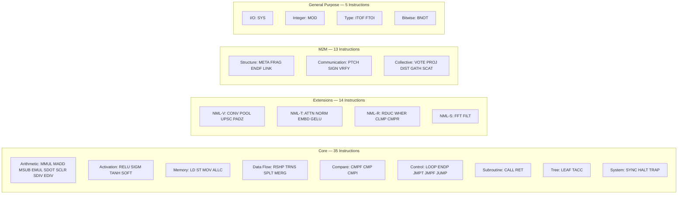
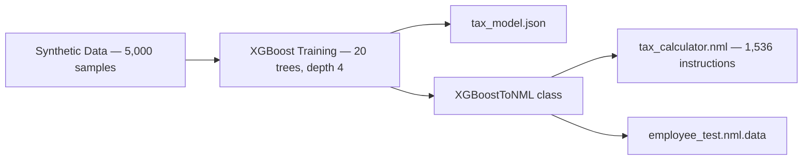
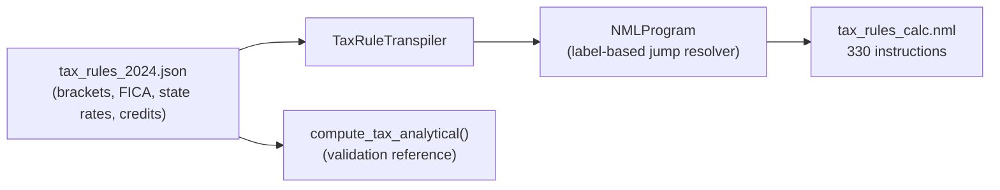
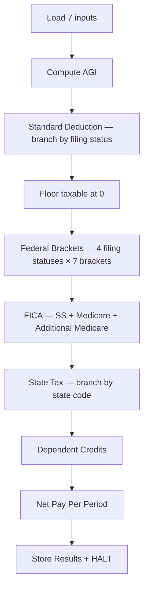
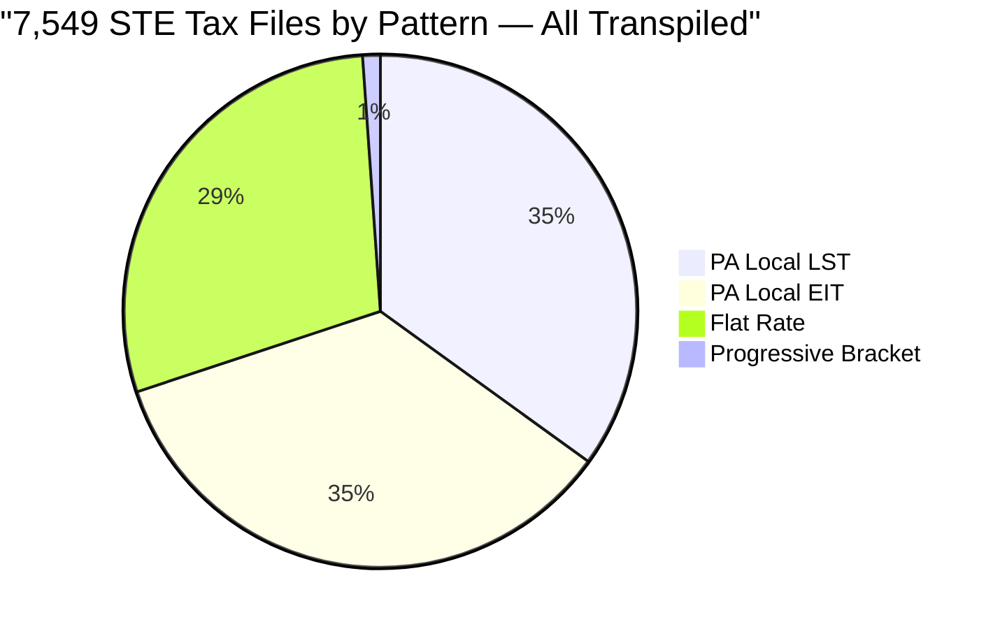
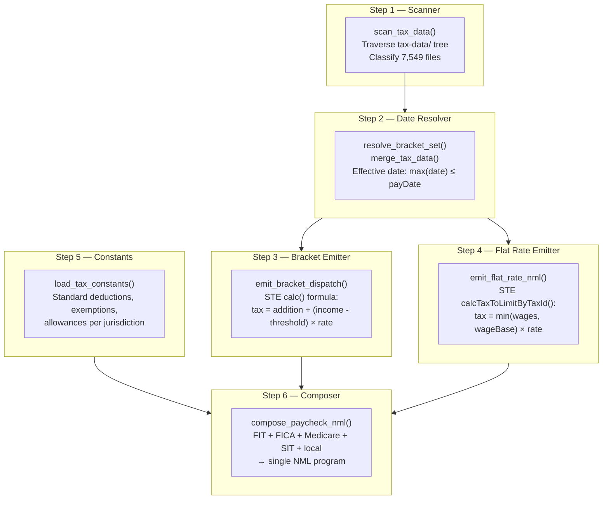
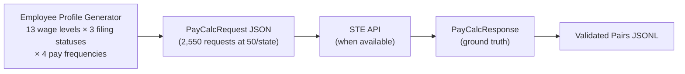
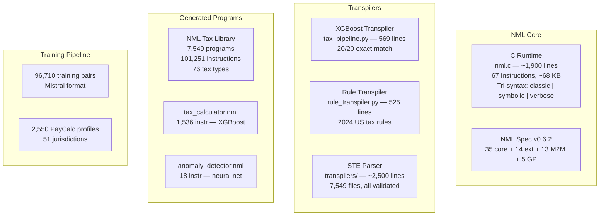

# NML — Implementation Document

## What Was Built

This document describes the complete implementation of the NML (Neural Machine Language) system: a 67-instruction machine language for AI workloads with a ~51KB C runtime, three transpiler pipelines (XGBoost, deterministic rules, and STE), an STE-to-NML parser covering 7,549 tax jurisdiction files (all 7,549 transpiled and validated), a tri-syntax system (classic/symbolic/verbose), a training data generator for LLM fine-tuning, and a general-purpose extension (NML-G) enabling console I/O and integer math.

---

## System Architecture

```mermaid
flowchart TD
    subgraph sources [Source Data]
        XGB[Trained XGBoost Model]
        JSON[JSON Tax Rules]
        STE[STE Tax Data — 7,549 Files]
        NN[Neural Network Weights]
    end

    subgraph transpilers [Transpiler Layer]
        XGBTrans[XGBoost Transpiler — tax_pipeline.py]
        RuleTrans[Rule Transpiler — rule_transpiler.py]
        STETrans[STE Transpiler — ste_transpiler.py]
    end

    subgraph nml_programs [NML Programs]
        TaxCalc[tax_calculator.nml — 1,536 instr]
        RulesCalc[tax_rules_calc.nml — 330 instr]
        FIT[fit_2025.nml — 479 instr]
        CASIT[ca_sit_2025.nml — 233 instr]
        FICA[fica_2025.nml — 16 instr]
        Anomaly[anomaly_detector.nml — 18 instr]
        Extensions[extension_demo.nml — 38 instr]
    end

    subgraph runtime [NML Runtime]
        NMLFull["nml (full) — ~68 KB, 67 instructions"]
        NMLCore["nml-core — ~50 KB, 35 instructions"]
        NMLGP["nml-gp — ~68 KB, expanded limits"]
    end

    subgraph training [Training Data Pipeline]
        Oracle[STE Oracle — ste_oracle.py]
        Validate[Validation Pipeline — ste_validate.py]
        TrainGen[Training Generator — ste_training_gen.py]
        Dataset["Training Dataset — 96,710 pairs"]
    end

    subgraph agents [Agent Services Layer]
        TranspilerSvc["Transpiler Service — port 8083"]
        ValidatorSvc["Validation Service — port 8084"]
        EngineSvc["Execution Service — port 8085"]
        Gateway["Agent Gateway — port 8082"]
        Orchestrator["Intent Router + Pipeline Executor"]
        GrammarVal["Grammar Validator — nml_grammar.py"]
        SemanticVal["Semantic Analyzer — nml_semantic.py"]
        AnomalyDet["Anomaly Detector — nml_anomaly.py"]
    end

    XGB --> XGBTrans --> TaxCalc
    JSON --> RuleTrans --> RulesCalc
    STE --> STETrans --> FIT & CASIT & FICA

    NN --> Anomaly
    NN --> Extensions

    TaxCalc & RulesCalc & FIT & Anomaly --> NMLFull
    TaxCalc & RulesCalc & FIT & Anomaly --> NMLCore

    STE --> Oracle --> Validate
    STETrans --> Validate
    Validate --> TrainGen --> Dataset

    STETrans --> TranspilerSvc
    Validate --> ValidatorSvc
    NMLFull --> EngineSvc
    GrammarVal --> ValidatorSvc
    SemanticVal --> ValidatorSvc
    Gateway --> TranspilerSvc & ValidatorSvc & EngineSvc
    Orchestrator --> Gateway
```



---

## Component 1: NML Runtime (`nml.c`)

**~1,900 lines of C99.** Single-file runtime implementing the full NML instruction set with tri-syntax support, M2M extensions, and general-purpose I/O.

### Build

| Binary | Instructions | Size (stripped) | Build |
|--------|-------------|-----------------|-------|
| `nml` | 67 (35 core + 14 ext + 13 M2M + 5 GP) | ~68 KB | `make` |
| `nml-core` | 35 (core only) | ~50 KB | `make nml-core` |
| `nml-gp` | 67 (expanded limits for GP programs) | ~68 KB | `make nml-gp` |

```bash
make all       # Build full + core binaries
make nml-gp    # Build with expanded resource limits
make release   # Build + strip for smallest size
make test      # Run all test programs
```

### Instruction Set



All 67 instructions support three syntax forms: classic (MMUL), symbolic (×), and verbose (MATRIX_MULTIPLY).

### Register File

| Register | Purpose |
|----------|---------|
| R0–R9 | General-purpose tensor registers |
| RA | Accumulator (tree prediction / federal tax) |
| RB | General-purpose (FICA accumulator) |
| RC | Scratch (leaf values, bracket thresholds) |
| RD | Loop counter |
| RE | Condition flag (set by CMPF, CMP, CMPI) |
| RF | Stack pointer |

### Test Results

| Program | Instructions | Cycles | Time | Result |
|---------|-------------|--------|------|--------|
| Anomaly Detector (NN) | 18 | 18 | 419 µs | Score: 0.5060 |
| Tax Calculator (XGBoost) | 1,536 | 267 | 88 µs | Net pay: $1,721.71 |
| Extension Demo | 38 | 38 | 715 µs | All extensions validated |
| Tax Rules (deterministic) | 330 | 75 | 703 µs | Net pay: $6,205.43 |

### v0.5 Features

- Tri-syntax aliases: all opcodes accept classic (MMUL), symbolic (×), and verbose (MATRIX_MULTIPLY) forms
- Greek register aliases: ι κ λ μ ν ξ ο π ρ ς (R0-R9) and α β γ δ φ ψ (RA-RF)
- Verbose register aliases: ACCUMULATOR, SCRATCH, FLAG, COUNTER, GENERAL, STACK
- `--syntax` flag on transpiler and library builder for output mode selection
- `--no-comments` flag to strip comments for minimal file size

---

## Component 2: XGBoost Transpiler (`tax_pipeline.py`)

**569 lines of Python.** Trains an XGBoost model on synthetic payroll data and transpiles the trained trees to NML.

### Pipeline



### Validation

20/20 exact match ($0.00 difference) between XGBoost Python predictions and NML runtime output.

| Employee | XGBoost | NML | Difference |
|----------|---------|-----|-----------|
| Junior Developer ($65k) | $1,721.71 | $1,721.71 | $0.00 |
| Senior Manager ($185k) | $4,764.52 | $4,764.52 | $0.00 |
| Executive ($350k) | $8,329.82 | $8,329.82 | $0.00 |
| Part-time Worker ($28k) | $697.25 | $697.25 | $0.00 |

---

## Component 3: Deterministic Rule Transpiler (`rule_transpiler.py`)

**525 lines of Python.** Converts JSON tax rules with exact bracket boundaries into deterministic NML programs. No ML training required.

### Architecture



### NML Program Structure



### Validation

All 4 test employees match analytical computation exactly:

| Employee | Analytical | NML | Federal | FICA |
|----------|-----------|-----|---------|------|
| Junior Dev ($65k, Single, TX) | $2,112.06 | $2,112.06 | $5,114.00 | $4,972.50 |
| Senior Mgr ($185k, Married, CA) | $6,205.43 | $6,205.43 | $16,242.00 | $13,135.70 |
| Executive ($350k, Single, NY) | $10,248.79 | $10,248.79 | $63,264.75 | $16,878.20 |
| Part-time ($28k, HoH, FL) | $538.46 | $538.46 | $610.00 | $2,142.00 |

### Bugs Found and Fixed

1. **Register aliasing in MSUB**: `MSUB R8 R7 R8` (Rd == Rs2) silently computes 0 because `tensor_sub` copies Rs1 into Rd before reading Rs2. Fixed by using RC as intermediate.
2. **State tax fallthrough**: State code 0 (no tax) was incorrectly applying the code-1 rate due to CMPF threshold grouping. Fixed with explicit early-exit for zero-rate codes.

---

## Component 4: STE-to-NML Parser (`transpilers/`)

**~3,500 lines of Python across 7 files.** Reads 7,549 Symmetry Tax Engine JSON files and generates NML programs replicating the STE's `calc()` and `calcTaxToLimitByTaxId()` formulas.

### File Inventory

| File | Lines | Purpose |
|------|-------|---------|
| `nml_builder.py` | ~150 | Program builder with label resolution + tri-syntax translation |
| `ste_transpiler.py` | ~1,070 | Scanner, date resolver, bracket emitter, flat-rate emitter, `--syntax` flag |
| `ste_build_library.py` | ~220 | Full library builder (7,549 programs → nml-library/ + manifest.json) |
| `ste_oracle.py` | ~310 | PayCalcRequest generator for STE API validation |
| `ste_validate.py` | ~270 | Transpile → execute → compare pipeline |
| `ste_training_gen.py` | ~950 | Training data generator (4+ formats) |
| `nml_syntax_gen.py` | ~450 | Syntax-specific training data generation |

### STE Data Coverage



| Tax Type | File Count | Pattern | Example |
|----------|-----------|---------|---------|
| LST (Local Services Tax) | 2,639 | PA local | `42-103-1216964-LST-452003.json` |
| EIT (Earned Income Tax) | 2,639 | PA local | `42-103-1216964-EIT-452003.json` |
| CITY (municipal) | 769 | Flat rate | `39-000-1058142-CITY-000.json` |
| SCHL (school district) | 613 | Flat rate | `39-000-0000-SCHL-7402.json` |
| SIT (state income) | 56 | Bracket | `06-000-0000-SIT-000.json` |
| PIT (provincial — Canada) | 13 | Bracket | `82-000-0000-PIT-000.json` |
| FIT (federal income) | 2 | Bracket | `00-000-0000-FIT-000.json` |
| FICA | 2 | Flat rate | `00-000-0000-FICA-000.json` |

### Transpilation Pipeline



### STE Formula Mapping

The STE calculates progressive bracket taxes in `ste/luacode/modules/globals.lua:525`:

```
tax = (taxableAmount - bracket) * percent + addition
```

This maps to NML as:

```
CMPF  RE R7 #0 #next_threshold   ; income < next tier?
JMPF  @this_tier                  ; no: income >= threshold, use this tier
...
@this_tier:
LEAF  RA #addition                ; cumulative base tax
LEAF  RC #threshold               ; bracket floor
MSUB  R8 R7 RC                   ; marginal income = income - floor
SCLR  R8 R8 #rate                ; marginal tax = marginal_income × rate
TACC  RA RA R8                   ; total = base + marginal
```

### Validation Results

**All 7,549 files transpiled and executed — zero errors.**

| Metric | Result |
|--------|--------|
| Files scanned | 7,549 |
| Files transpiled to NML | 7,549 / 7,549 (100%) |
| NML programs that assembled | 7,549 / 7,549 (100%) |
| NML programs that executed | 7,549 / 7,549 (100%) |
| Runtime errors | 0 |
| Total instructions | 101,251 |
| Total library size | 3.89 MB |
| Build time (transpile only) | 6.6 seconds |
| Build + validate time | 79 seconds |

Sample outputs:

| Tax File | Gross Pay | NML Tax Amount | Cycles |
|----------|----------|---------------|--------|
| FIT (Federal, 2025, single) | $100,000 | $12,117.00 | 25 |
| CA SIT (California, 2025, single) | $100,000 | $4,260.50 | 25 |
| FICA (2025, under cap) | $100,000 | $6,200.00 | 8 |
| FICA (2025, over cap at $176,100) | $200,000 | $10,918.20 | 10 |
| Indiana County Tax (1.28%) | $75,000 | $825.00 | 6 |
| MD Anne Arundel County (3.03%) | $75,000 | $2,272.50 | 6 |

---

## Component 5: Training Data Pipeline

### Oracle Harness (`ste_oracle.py`)

Generates randomized employee profiles across all 51 US jurisdictions and formats them as STE PayCalcRequests.



### Training Data Generator (`ste_training_gen.py`)

Produces training examples in four formats from the transpiled NML programs:

| Format | Count | Description |
|--------|-------|-------------|
| Transpilation | ~500 | STE JSON → NML program |
| Intent-to-NML | ~355 | Natural language → NML + employee data |
| Audit Trail | ~380 | Employee profile → step-by-step tax breakdown |
| Q&A | ~119 | Tax knowledge questions and answers |
| **Base Total** | **~1,354** | (nml_training_large.jsonl) |
| **Expanded (MLX)** | **96,710** | Full Mistral instruction-tuning format (train + valid) |

### Audit Trail Example

```
Gross pay: $95,481.00
Filing status: Married

FICA (Social Security):
  Subject wages: $95,481.00
  Rate: 6.20%
  Tax: $5,919.82

Medicare:
  Subject wages: $95,481.00
  Rate: 1.45%
  Tax: $1,384.47

State Income Tax (RI):
  1.0% on $0 – $77,450 = $774.50
  2.75% on $77,450 – $95,481 = $495.85
  Total state income tax: $1,270.35

Total tax: $8,574.64
Net pay (annual): $86,906.36
```

---

## Component Summary



### Performance Summary

| Metric | Value |
|--------|-------|
| NML runtime size (stripped) | ~68 KB (full), ~50 KB (core) |
| NML vocabulary | ~67 symbols (classic) + symbolic + verbose aliases |
| Token count (typical NN program) | 20–50 tokens |
| Inference time (XGBoost, 20 trees) | 88 µs |
| Inference time (FIT bracket lookup) | 145 µs |
| Inference time (FICA flat rate) | 85 µs |
| Full library build (7,549 files) | 6.6 seconds |
| Full library build + validate | 79 seconds |
| STE tax files transpiled | 7,549 / 7,549 (100%) |
| Training pairs generated | 96,710 (Mistral format) |
| Syntax modes | 3 (classic, symbolic, verbose) |

---

## Multi-Agent Services Layer

The NML system now includes a multi-agent services layer that wraps the core components as HTTP services with an orchestration pipeline. See [NML_Multi_Agent_Architecture.md](NML_Multi_Agent_Architecture.md) for the full architecture and [NML_Multi_Agent_Implementation_Plan.md](NML_Multi_Agent_Implementation_Plan.md) for the implementation details.

### Agent Services

| Service | Port | Implementation | Status |
|---------|------|---------------|--------|
| Transpiler | 8083 | `serve/transpiler_service.py` | Implemented and tested |
| Validator | 8084 | `serve/validation_service.py` | Implemented and tested |
| Execution Engine | 8085 | `serve/execution_service.py` | Implemented and tested |
| Agent Gateway | 8082 | `transpilers/domain_rag_server.py` | Implemented and tested |

### Validation Tools

| Tool | Implementation | Status |
|------|---------------|--------|
| Grammar Validator | `transpilers/nml_grammar.py` | 7,549/7,549 programs pass |
| Semantic Analyzer | `transpilers/nml_semantic.py` | Extracts brackets, rates, deductions |
| Regression Suite | `transpilers/nml_regression.py` | Golden test baselines |
| NML Diff Engine | `transpilers/nml_diff.py` | Semantic bracket/rate comparison |
| Anomaly Detector | `transpilers/nml_anomaly.py` | Cross-jurisdiction scanning |

### Orchestration

| Component | Implementation | Status |
|-----------|---------------|--------|
| Intent Router | `serve/intent_router.py` | 7 intent categories |
| Agent Registry | `serve/agent_registry.py` | Health tracking + call stats |
| Pipeline Executor | `serve/pipeline_executor.py` | 6 pipeline types |
| Agent Protocol | `serve/nml_protocol.py` | AgentMessage envelope |
| Provenance Tracker | `serve/provenance_tracker.py` | Instruction-level tracing |
| Audit Log | `serve/audit_log.py` | Append-only JSONL log |

## Component 7: NML v0.6 M2M Extensions

**11 new opcodes** extending NML for machine-to-machine communication. See [NML_M2M_Spec.md](NML_M2M_Spec.md) for the full specification.

### Build

```bash
make nml-v06    # Build v0.6 runtime with M2M extensions
```

| Binary | Instructions | Description |
|--------|-------------|-------------|
| `nml-v06` | 60 (35 core + 14 ext + 11 M2M) | Full runtime with M2M extensions |

### Test Results

```bash
./nml-v06 tests/test_m2m.nml tests/test_m2m.nml.data
```

| Test | Result | Details |
|------|--------|---------|
| VOTE median | 6200.00 | Correct median of [6200, 6200.01, 6199.98, 6200, 6150] |
| VOTE mean | 6189.998 | Correct arithmetic mean |
| VOTE quorum | 1.0 | 4 of 5 values agree within 0.01 tolerance |
| PROJ | [0.7071, 0.7071] | Unit-norm 2D projection |
| DIST cosine | 0.0077 | Small distance (similar vectors) |
| DIST euclidean | 0.1243 | Euclidean distance |
| META --describe | PASS | Prints program descriptor |
| Backward compat | PASS | All v0.5 programs run unchanged |
| Grammar validator | 7549/7549 PASS | All existing programs valid under updated validator |

### Runtime Fixes (v0.6.1)

Critical bugs fixed after initial v0.6 release:

| Fix | Problem | Solution |
|-----|---------|----------|
| Register aliasing | `MSUB R0 R0 R2` produced wrong results — tensor_init zeroed output before reading aliased input | Added temporary buffer when output aliases input in tensor_add/sub/emul/ediv/mmul |
| MMUL f64 | Matrix multiply used hardcoded `data.f32[]`, ignoring dtype | Replaced with `tensor_getd()`/`tensor_setd()` for dtype-aware access |
| RELU/SIGM/TANH/SOFT f64 | Activation functions used hardcoded `data.f32[]` | Replaced with dtype-aware `tensor_getd()`/`tensor_setd()` |
| GATH opcode | No way to index into a tensor by position | Added `GATH Rd Rs Ridx` (opcode 60) |
| SCAT opcode | No way to write to a specific tensor index | Added `SCAT Rs Rd Ridx` (opcode 61) |

### Validation Results

| Validation | Result |
|------------|--------|
| Golden regression | **7,549/7,549 PASS** — zero failures across entire NML library |
| STE MCP validation | **14/14 MATCH** — FICA, MEDI, ER_FICA, ER_MEDI at $0.00 difference |
| Grammar validator | 7,549/7,549 valid with v0.6 opcodes |

### Neural Bracket Experiment

Tax brackets encoded as neural network weights (64-neuron ReLU):

| Filing Status | MAE | Max Error |
|---------------|-----|-----------|
| Single | $32 | $145 |
| MFJ | $55 | $317 |
| HoH | $32 | $169 |

After RELU f64 fix, NML execution matches numpy inference: $1-$12 error at most income levels for 128-neuron model.

### Embedding Anomaly Monitor

Trained neural embeddings for 53 bracket jurisdictions, compared 2024 vs 2025:
- **2 ALERTS**: Maryland SIT (brackets expanded 5→10 tiers), PEI PIT (minor drift)
- **51 NORMAL**: Expected inflation adjustments or no change
- Report saved to `output/anomaly_reports/`

### LLM Fine-Tuning (Round 2)

| Metric | Round 1 | Round 2 |
|--------|---------|---------|
| Iterations | 700 | 6,000 |
| Learning rate | 5e-6 | 1.5e-5 |
| Val loss | ~0.8 | **0.396** |
| Training pairs | 149,674 | 149,674 + 15,189 gap pairs |
| Result | Generated pseudocode | **Generates valid NML in classic and symbolic syntax** |

Model saved to `output/model/nml-v06-r2-merged`.

### New Python Tools

| Tool | File | Purpose |
|------|------|---------|
| Type System | `serve/nml_types.py` | Semantic types, compatibility rules |
| Fragment Composer | `transpilers/nml_composer.py` | Extract, resolve, compose fragments |
| Patch Engine | `transpilers/nml_patch.py` | Differential program generation |
| Signing | `serve/nml_signing.py` | HMAC-SHA256 / Ed25519 signing |
| Embedding | `transpilers/nml_embedding.py` | Projection matrices, distance computation |

---

## Component 8: NML-G General Purpose Extension

**5 new opcodes** extending NML for general-purpose computing. See [NML_G_Spec.md](NML_G_Spec.md) for the full specification.

### Build

```bash
make nml-gp    # Build with expanded resource limits
```

| Binary | Instructions | Description |
|--------|-------------|-------------|
| `nml-gp` | 67 (35 core + 14 ext + 13 M2M + 5 GP) | Full runtime with expanded limits |

### New Instructions

| Instruction | Symbolic | Description |
|---|---|---|
| `SYS Rd #code` | `⚙` | Multiplexed syscall (print, read, time, rand, exit) |
| `MOD Rd Rs1 Rs2` | `%` | Integer modulo |
| `ITOF Rd Rs` | `⊶` | Integer → float conversion |
| `FTOI Rd Rs` | `⊷` | Float → integer (truncate) |
| `BNOT Rd Rs` | `¬` | Bitwise NOT |

### Configurable Resource Limits (v0.6.2)

All hard limits now accept compile-time overrides:

```bash
gcc -O2 -o nml-gp nml.c -lm \
    -DNML_MAX_INSTRUCTIONS=65536 \
    -DNML_MAX_MEMORY_SLOTS=256 \
    -DNML_MAX_CALL_DEPTH=128
```

### Test Results

| Program | Instructions | Cycles | Output |
|---------|-------------|--------|--------|
| hello_world.nml | 29 | 29 | "Hello, World!" |
| fibonacci.nml | 13 | 165 | First 20 Fibonacci numbers |
| fizzbuzz.nml | 29 | 418 | FizzBuzz 1-30 |
| primes.nml | 23 | 1,276 | Primes 2-50 |
| calculator.nml | 16 | 14 | Interactive add/sub/mul/div |
| Backward compat | PASS | — | All existing programs run unchanged |

### Example Programs

| Program | File | Demonstrates |
|---------|------|-------------|
| Hello World | `programs/hello_world.nml` | SYS #1 (PRINT_CHAR) |
| Fibonacci | `programs/fibonacci.nml` | SYS #0, backward jumps, CMP |
| Fibonacci (symbolic) | `programs/fibonacci_symbolic.nml` | Same in ⚙/≶/↗ symbolic syntax |
| FizzBuzz | `programs/fizzbuzz.nml` | MOD, conditional branches |
| Prime Finder | `programs/primes.nml` | Nested loops, MOD, trial division |
| Calculator | `programs/calculator.nml` | SYS #2 (READ_NUM), interactive I/O |

---

### Next Steps

1. **Run STE oracle** — Connect to the STE API via MCP server, capture PayCalcResponses as ground truth, validate NML output against STE to $0.01 accuracy per tax component.
2. **Scale training data** — With STE oracle validation, expand from 1,354 to 200K+ training pairs using all 7,549 tax files x 30 employee variations each.
3. **Fine-tune LLM** — Train CodeLlama/Mistral 7B on the NML dataset using QLoRA (estimated 4-8 hours on 1x A100).
4. **Convergence experiment** — Train matched 125M-param models on NML vs Python, compare convergence to validate the core thesis.
5. **Full golden test generation** — Expand regression suite from 10 to all 7,549 jurisdictions.
6. **Cross-model federation** — Test agent pipeline with multiple LLM backends (Mistral, Llama, Phi).
7. **Self-improving feedback loop** — Use explanation agent outputs as training data for the regulation parser.
