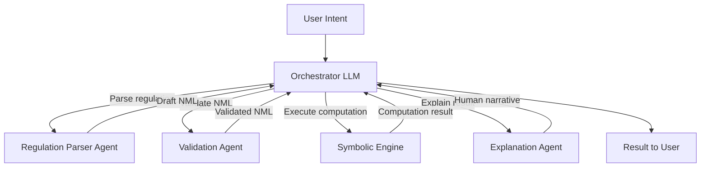
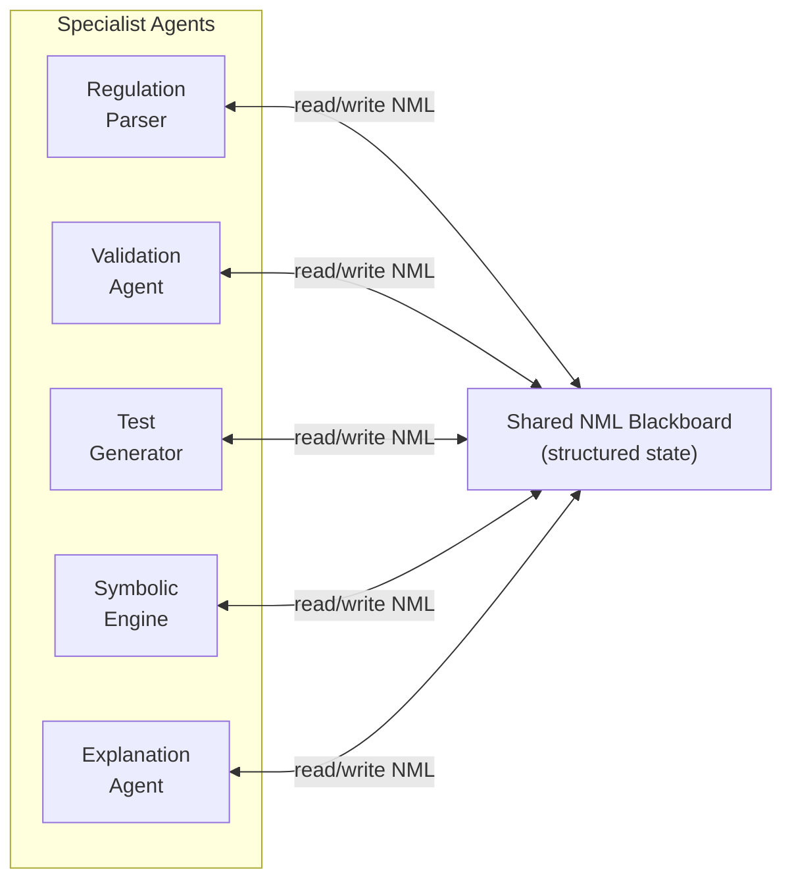
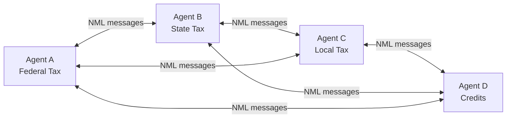
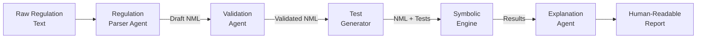
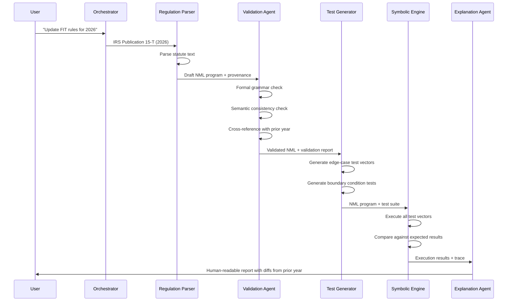
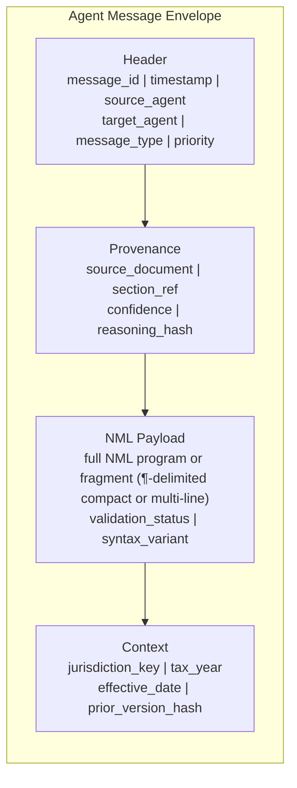
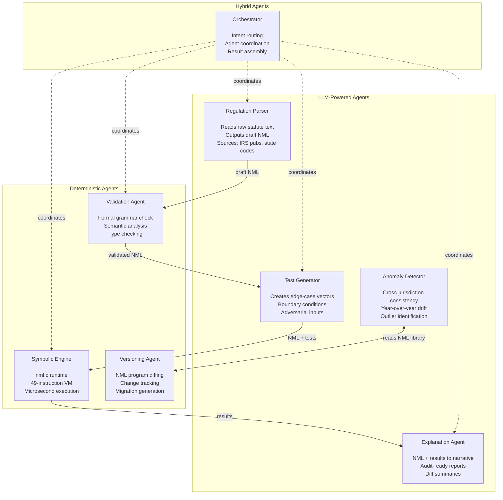

# NML Multi-Agent Architecture

## Distributed LLM Communication with NML as the Formal Nervous System

---

## Executive Summary

Monolithic LLMs fail in mission-critical domains. A single large language model asked to "calculate federal income tax withholding for a married-filing-jointly employee in California" will produce a plausible-sounding answer that may be wrong, cannot be audited, is not deterministic, and costs orders of magnitude more than a direct computation. In regulated industries — tax, payroll, healthcare, finance — plausible is not acceptable. Correct, traceable, and reproducible are the minimum requirements.

The alternative is not to abandon LLMs, but to decompose the problem into specialized agents that communicate through a formal intermediate representation. NML serves as that representation: the deterministic, verifiable "spinal cord" connecting a hive of specialized LLM agents. Each agent does what it is best at. The formal language between them ensures that ambiguity, hallucination, and drift do not propagate across the system.

This document describes the architecture for that multi-agent system — how agents are organized, how they communicate, what NML's role is as the interchange format, and how the existing NML infrastructure evolves to support it.

### Monolithic LLM vs. Multi-Agent + NML

| Property | Monolithic LLM | Multi-Agent + NML |
|---|---|---|
| Correctness | Probabilistic, may hallucinate | Symbolic engine guarantees exact results |
| Auditability | Black box, no trace | Every NML instruction is traceable |
| Determinism | Stochastic, varies across calls | Same input always produces same output |
| Latency per query | 500ms–5s (inference) | Microseconds (symbolic execution) |
| Cost per query | $0.001–$0.10 (API / GPU) | Near zero (C runtime, no GPU needed) |
| Regulatory compliance | "The AI said so" | Full instruction-level audit trail |
| Specialization | One model does everything | Each agent is optimized for its task |
| Error propagation | Undetectable until output | Formal verification at every stage |
| Scalability | Vertical (bigger model) | Horizontal (more agents) |

---

## Part 1: Architectural Patterns

There are four fundamental ways to organize communicating agents. Each has distinct trade-offs. The NML system draws from multiple patterns depending on the task.

### Pattern 1: Orchestrator + Specialists (Star Topology)

A central orchestrator understands user intent and delegates subtasks to domain-specific agents. The orchestrator does not need deep domain knowledge — it needs to know *who* to ask and how to assemble the results.



**Strengths:** Simple to reason about. Clear authority hierarchy. Easy to add new specialists without changing existing ones.

**Weaknesses:** Single point of failure. Orchestrator becomes a bottleneck. All communication routes through the center, adding latency.

**Best for:** Well-defined workflows where the orchestrator can be statically programmed. User-facing applications where a single entry point is required.

### Pattern 2: Blackboard Architecture (Shared State)

Agents read from and write to a shared knowledge space. No agent talks directly to another. Instead, each monitors the blackboard and acts when it sees data in its domain. This is a classic AI pattern from the 1980s (Hearsay-II speech system) that maps naturally to NML.



**Strengths:** Decoupled agents. Any agent can contribute at any time. Natural fit for NML as the shared state format. Agents can be added or removed without changing the system.

**Weaknesses:** Requires conflict resolution when multiple agents write simultaneously. Harder to trace causality. Needs a subscription/notification mechanism so agents know when to act.

**Best for:** Exploratory problems where the workflow is not predetermined. Research environments. Collaborative authoring of NML rules across jurisdictions.

### Pattern 3: Swarm / Peer-to-Peer

No central authority. Agents communicate directly, reach consensus through voting or negotiation, and handle conflicts locally. Inspired by biological systems — ant colonies, immune systems, neural networks themselves.



**Strengths:** No single point of failure. Highly resilient. Scales horizontally. Mirrors how tax jurisdictions actually work — independent authorities with overlapping concerns.

**Weaknesses:** Consensus is expensive. Hard to guarantee convergence. Debugging is difficult. Communication overhead grows quadratically with agent count.

**Best for:** Systems where resilience matters more than latency. Distributed computation across geographic regions. Future-state NML networks where agents run on different hardware.

### Pattern 4: Pipeline / Assembly Line

Each agent handles one transformation stage. The output of one becomes the input of the next. Linear, predictable, and easy to reason about.



**Strengths:** Easy to understand, test, and debug. Each stage has clear inputs and outputs. Natural fit for the NML transpilation workflow that already exists. Stages can be independently versioned and deployed.

**Weaknesses:** Rigid. One slow stage blocks the entire pipeline. Cannot handle tasks that require iteration or backtracking without adding complexity.

**Best for:** The primary tax computation workflow. Batch processing of jurisdiction updates. CI/CD-style pipelines for tax rule deployment.

### Pattern Comparison

| Pattern | Complexity | Resilience | Latency | Debuggability | NML Fit |
|---|---|---|---|---|---|
| Orchestrator | Low | Low | Medium | High | Good |
| Blackboard | Medium | Medium | Variable | Medium | Excellent |
| Swarm | High | High | High | Low | Good |
| Pipeline | Low | Low | Predictable | Highest | Excellent |

---

## Part 2: The NML Agent Pipeline

The pipeline pattern is the primary proposed architecture for the NML tax domain. It maps directly to the existing codebase and extends it with agent-level capabilities.

### End-to-End Flow



### Mapping to Existing Components

The pipeline is not theoretical. The existing NML project already implements stages of this pipeline, currently as standalone scripts rather than communicating agents.

| Pipeline Stage | Current Implementation | Agent Evolution |
|---|---|---|
| Regulation Parser | `transpilers/ste_transpiler.py` — parses 7,549 STE JSON files into NML | LLM agent that reads raw statute text (not pre-structured JSON) and outputs draft NML |
| Validation Agent | `transpilers/ste_validate.py` — transpile + execute + compare | Formal NML grammar checker + semantic analysis + cross-jurisdiction consistency |
| Test Generator | `transpilers/ste_oracle.py` — generates PayCalcRequest test vectors | LLM agent that generates adversarial edge cases from regulation text |
| Symbolic Engine | `runtime/nml.c` — 49-instruction VM, ~51KB | Unchanged. The engine is already deterministic and correct. No LLM needed. |
| Explanation Agent | `terminal/nml_chat.jsx` — chat interface with RAG | LLM agent that takes NML program + execution trace and generates audit narrative |
| Training Pipeline | `transpilers/ste_training_gen.py` — 96,710 training pairs | Generates fine-tuning data from agent interactions for continuous improvement |

### What Changes, What Stays

The symbolic engine (`nml.c`) does not become an agent. It remains a deterministic executor. This is a critical architectural decision: the component that must be absolutely correct is not an LLM. It is a C program that executes fixed-width instructions. LLMs handle the fuzzy parts (parsing regulations, generating tests, explaining results). The formal system handles the exact parts (validation, execution).

---

## Part 3: Communication Protocol Design

### Why Natural Language Between Agents Fails

When Agent A sends Agent B a message in natural language — "The standard deduction for married filing jointly is $29,200" — several failure modes emerge:

1. **Ambiguity.** Does "$29,200" refer to 2024 or 2025? Per year or per period? Before or after phase-out?
2. **Hallucination propagation.** If Agent A hallucinated the number, Agent B has no mechanism to detect this from the natural language alone.
3. **Semantic drift.** Over multiple agent-to-agent hops, meaning shifts. Like a game of telephone.
4. **Unparseable variance.** Agent A might say "twenty-nine thousand two hundred" in one message and "$29,200.00" in another. Agent B must handle both.

NML eliminates all four failure modes. The same information in NML:

```
∎  γ  #29200.00
```

This is unambiguous (a literal value loaded into register gamma), machine-parseable (fixed-width token format), verifiable (the validator can check it against source data), and identical every time (one way to express each computation).

### Message Envelope Format

Agent-to-agent messages use a structured envelope that wraps NML payloads with metadata and provenance.



#### Header Fields

| Field | Type | Purpose |
|---|---|---|
| `message_id` | UUID | Unique identifier for this message |
| `timestamp` | ISO-8601 | When the message was created |
| `source_agent` | string | Agent that produced this message |
| `target_agent` | string | Intended recipient (or `broadcast`) |
| `message_type` | enum | `draft_nml`, `validated_nml`, `test_request`, `execution_result`, `explanation` |
| `priority` | int | 0 (routine) to 9 (critical — e.g., mid-year tax law change) |

#### Provenance Fields

| Field | Type | Purpose |
|---|---|---|
| `source_document` | string | Original regulation (e.g., "IRS Pub 15-T 2026, Table 1") |
| `section_ref` | string | Specific section or paragraph |
| `confidence` | float | Agent's self-assessed confidence (0.0–1.0) |
| `reasoning_hash` | SHA-256 | Hash of the agent's reasoning chain, for reproducibility |

#### NML Payload

The actual NML program or fragment. Always includes:
- `syntax_variant`: `symbolic`, `classic`, `verbose`, or their `-compact` variants (e.g. `symbolic-compact`)
- `validation_status`: `draft`, `grammar_valid`, `semantically_valid`, `tested`, `production`
- The NML instructions themselves

For agent-to-agent transport, the **compact form** is preferred: instructions are delimited by `¶` (U+00B6, pilcrow) instead of newlines, producing a single-line string that embeds cleanly in JSON without escaping. The runtime parses `¶` natively.

```json
{
  "payload": "§ @name \"fit\"¶↓ ι @gross_pay¶∗ γ ι #0.062¶∑ α α γ¶↑ α @tax_amount¶◼",
  "syntax_variant": "symbolic-compact",
  "validation_status": "tested"
}
```

#### Context Fields

| Field | Type | Purpose |
|---|---|---|
| `jurisdiction_key` | string | e.g., `00-000-0000-FIT-000` (federal income tax) |
| `tax_year` | int | Effective tax year |
| `effective_date` | date | When the rules take effect |
| `prior_version_hash` | SHA-256 | Hash of the NML program this replaces, enabling diffing |

### Comparison with Existing Protocols

| Protocol | Scope | Agent-to-Agent | Formal Payload | Domain Awareness |
|---|---|---|---|---|
| **MCP** (Model Context Protocol) | LLM to tools | No (LLM to server) | JSON-RPC | None |
| **Google A2A** (Agent-to-Agent) | General agent comm | Yes | Unstructured | None |
| **OpenAI Function Calling** | LLM to functions | No (LLM to code) | JSON Schema | None |
| **NML Agent Protocol** (proposed) | Domain agents | Yes | NML programs | Tax/payroll native |

The key differentiator: existing protocols treat the payload as opaque data. The NML agent protocol treats the payload as a *formally verifiable program* that any receiving agent can validate, execute, diff, or extend. The payload is not just data — it is *computation*.

---

## Part 4: Agent Specialization Taxonomy

### Agent Roles



### Detailed Agent Specifications

#### Regulation Parser Agent

| Property | Value |
|---|---|
| Type | LLM-powered |
| Input | Raw statute text, IRS publications, state tax codes |
| Output | Draft NML program + provenance metadata |
| Model size | 7B–13B parameters, fine-tuned on tax regulation corpus |
| Latency target | < 5 seconds per jurisdiction |
| Validation | Output must pass formal NML grammar check |
| Current analog | `ste_transpiler.py` (works on pre-structured JSON; agent works on raw text) |

#### Validation Agent

| Property | Value |
|---|---|
| Type | Deterministic (not LLM) |
| Input | Draft NML program |
| Output | Validated NML + validation report (errors, warnings) |
| Checks performed | Grammar validity, register usage correctness, unreachable code detection, bracket/threshold monotonicity, cross-reference with prior year |
| Latency target | < 100ms per program |
| Current analog | `ste_validate.py` |

#### Test Generation Agent

| Property | Value |
|---|---|
| Type | LLM-powered |
| Input | Validated NML program + regulation text |
| Output | Test vector suite (input/expected-output pairs) |
| Strategy | Boundary values at bracket thresholds, zero/negative/maximum inputs, filing status combinations, exemption edge cases |
| Latency target | < 3 seconds per jurisdiction |
| Current analog | `ste_oracle.py` (generates PayCalcRequest vectors) |

#### Symbolic Execution Engine

| Property | Value |
|---|---|
| Type | Deterministic (C runtime) |
| Input | NML program + input data |
| Output | Computation result + execution trace |
| Implementation | `runtime/nml.c` — 49 instructions, ~51KB binary |
| Latency | ~233 microseconds per execution |
| Guarantees | Bit-exact determinism, full instruction trace, zero dependencies beyond libc/libm |

#### Explanation Agent

| Property | Value |
|---|---|
| Type | LLM-powered |
| Input | NML program + execution trace + computation result |
| Output | Human-readable narrative explaining the calculation |
| Use cases | Audit reports, employee pay stub explanations, year-over-year change summaries |
| Model size | 3B–7B parameters, fine-tuned on NML-to-explanation pairs |
| Current analog | `terminal/nml_chat.jsx` (chat interface with RAG) |

#### Anomaly Detection Agent

| Property | Value |
|---|---|
| Type | LLM-powered or statistical |
| Input | Full NML library (7,549+ programs) |
| Output | Anomaly reports: unusual thresholds, missing jurisdictions, inconsistent bracket structures |
| Strategy | Cross-jurisdiction comparison, year-over-year delta analysis, statistical outlier detection |
| Trigger | Runs after batch updates (e.g., annual tax year rollover) |

#### Versioning Agent

| Property | Value |
|---|---|
| Type | Deterministic |
| Input | Two NML programs (prior version, new version) |
| Output | Structural diff: changed thresholds, added/removed brackets, modified rates |
| Use cases | Tax year rollover analysis, mid-year correction tracking, audit trail |
| Implementation | NML-aware diff (not line-level text diff, but semantic comparison of instruction sequences) |

---

## Part 5: Unsolved Challenges

### Disagreement Resolution

When two agents produce conflicting outputs — e.g., the Regulation Parser generates NML with a $29,200 standard deduction and the Validation Agent flags it as inconsistent with the source document — how is the conflict resolved?

**Proposed approaches:**
- **Authority hierarchy.** The agent closest to the source of truth wins. For tax rules, the Validation Agent's cross-reference against the original regulation text takes precedence over the Parser's interpretation.
- **Confidence scoring.** Each agent attaches a confidence score to its output. Low-confidence outputs are flagged for human review rather than auto-resolved.
- **Escalation.** Unresolved conflicts escalate to a human reviewer. The system provides both interpretations with supporting evidence. This is the safest default for regulated domains.

### Error Propagation and Rollback

In a pipeline, one bad output cascades through every downstream stage. A hallucinated tax bracket in the Parser stage produces a validated-but-wrong NML program, which generates passing-but-meaningless tests, which the engine faithfully executes to produce an incorrect result.

**Mitigations:**
- **Formal verification gates.** The Validation Agent checks NML against known structural invariants (e.g., tax brackets must be monotonically increasing, rates must sum to <= 1.0). These catch a class of errors that no LLM-based check would.
- **Golden test sets.** Each jurisdiction maintains a set of known-correct input/output pairs. Every pipeline run must pass these before proceeding.
- **Provenance chains.** Every NML instruction carries metadata linking it to the source regulation. An auditor can trace any suspicious output back to the exact statute text that generated it.
- **Rollback capability.** Every NML program version is hashed and stored. If a new version fails validation, the system automatically rolls back to the last known-good version.

### Trust and Verification

How does the orchestrator know that the Regulation Parser's output is correct? In a traditional software system, you trust code because it was written by a human and reviewed by another human. In an agent system, the "code" (NML) is generated by an LLM.

**The NML advantage:** Because NML is a formal language with a small, fixed instruction set, you can build verification tools that are provably correct. A grammar checker for 49 instructions is a tractable formal verification problem. A grammar checker for Python is not. The formal verifiability of NML is what makes multi-agent trust feasible — you do not need to trust the agent, you verify its output.

### Coordination Overhead

Each additional agent adds communication overhead: message serialization, network latency (if distributed), and the cognitive overhead of maintaining the protocol. For simple computations, the multi-agent pipeline is slower than a single transpiler script.

**Guideline:** Use multi-agent coordination only where the complexity warrants it. A simple FICA calculation (flat rate times gross pay) does not need six agents. A complete federal income tax withholding calculation across multiple filing statuses with EIC, dependent credits, and AMT does.

### The "TCP/IP of Agents" Problem

The industry lacks a universal standard for agent-to-agent communication. MCP addresses LLM-to-tool communication. Google A2A is early-stage. The NML agent protocol proposed here is domain-specific by design, but the broader problem remains: how do agents from different vendors, running different models, on different hardware, communicate reliably?

NML's contribution to this problem is at the payload level, not the transport level. NML does not replace TCP/IP or HTTP or gRPC. It provides a *formal, domain-specific payload format* that any transport can carry. The message envelope defined above can be serialized as JSON, protobuf, or MessagePack and sent over any transport.

---

## Part 6: From Current State to Multi-Agent

The existing NML system has been extended with a multi-agent services layer. All five phases of the roadmap are implemented and tested.

```mermaid
flowchart LR
    subgraph phase1 [Phase 1: Service Wrapping]
        T1["Wrap ste_transpiler.py\nas HTTP service"]
        T2["Wrap ste_validate.py\nas HTTP service"]
        T3["Wrap nml.c\nas execution service"]
    end

    subgraph phase2 [Phase 2: Validation Agents]
        V1["Formal NML\ngrammar checker"]
        V2["Semantic\nconsistency checker"]
        V3["Golden test\nregression suite"]
    end

    subgraph phase3 [Phase 3: Orchestrator]
        O1["Intent router"]
        O2["Agent registry"]
        O3["Result assembler"]
    end

    subgraph phase4 [Phase 4: Protocol]
        P1["Message envelope\nimplementation"]
        P2["Provenance\ntracking"]
        P3["Agent-to-agent\nNML exchange"]
    end

    subgraph phase5 [Phase 5: Hive Mind]
        H1["Swarm capabilities"]
        H2["Cross-vendor\nagent federation"]
        H3["Self-improving\npipelines"]
    end

    phase1 --> phase2 --> phase3 --> phase4 --> phase5
```



### Phase 1: Service Wrapping — IMPLEMENTED

Existing scripts are wrapped as callable services with defined inputs and outputs.

- `ste_transpiler.py` → `serve/transpiler_service.py` (port 8083): POST a jurisdiction key, receive an NML program
- `ste_validate.py` → `serve/validation_service.py` (port 8084): POST an NML program, receive a validation report
- `nml.c` → `serve/execution_service.py` (port 8085): POST NML + input data, receive computation result
- `domain_rag_server.py` extended with gateway routes proxying to all three services

**Test results:** All three services pass health checks. FICA transpile + execute returns $6,200 on $100,000 (correct). FIT full validation returns grammar valid, semantic valid, execution pass.

**STE MCP Validation:** Automated validation against the production Symmetry Tax Engine via local ctypes calls. 14/14 match at $0.00 difference for FICA, Medicare, employer FICA, and employer Medicare.

### Phase 2: Validation Agents — IMPLEMENTED

Formal validation beyond transpile-and-compare.

- `transpilers/nml_grammar.py`: formal grammar checker — **7,549/7,549 programs valid, 0 errors**
- `transpilers/nml_semantic.py`: bracket monotonicity, rate bounds, filing status coverage, standard deduction extraction
- `transpilers/nml_regression.py`: golden test baselines — **7,549/7,549 pass**
- `serve/validation_service.py` `/validate/full` endpoint chains grammar + semantic + execution

**Test results:** Grammar validator scans all 7,549 programs in 1.7 seconds with zero errors. Semantic analyzer correctly extracts all 2025 FIT brackets (7 per filing status), rates (10%–37%), and standard deductions ($8,600 Single / $12,900 MFJ).

### Phase 3: Orchestrator — IMPLEMENTED

Coordination layer routing user intents to agent pipelines.

- `serve/intent_router.py`: classifies messages into 7 intent categories with parameter extraction
- `serve/agent_registry.py`: tracks agent health, capabilities, rolling latency stats
- `serve/pipeline_executor.py`: chains agent calls — run_calculation, explain, update, validate, batch, compare, general_chat
- `terminal/nml_chat.jsx`: pipeline-first execution with PipelineDisplay component and agent status badge

### Phase 4: Inter-Agent Protocol — IMPLEMENTED

Structured message envelope and provenance tracking.

- `serve/nml_protocol.py`: AgentMessage with header, provenance, NML payload, context — JSON round-trip verified
- `serve/provenance_tracker.py`: instruction-level source tracing with sidecar JSON files
- `serve/audit_log.py`: append-only JSONL log with query, trace, and stats CLI

### Phase 5: Hive Mind — IMPLEMENTED

Distributed analysis and anomaly detection tools.

- `transpilers/nml_diff.py`: semantic NML diff — bracket thresholds, rates, deductions, cumulative amounts per filing status
- `transpilers/nml_anomaly.py`: cross-jurisdiction anomaly scanner — **scanned 7,549 programs**, found rate outliers, threshold outliers, and expected duplicate stubs for no-income-tax states
- Parallel processing, cross-vendor federation, and self-improving pipelines are architecturally supported but require LLM model availability for full testing

**Embedding Anomaly Monitor:** Trained neural embeddings for 53 bracket jurisdictions comparing 2024 vs 2025. Flagged Maryland SIT (brackets expanded 5→10 tiers) and PEI PIT as anomalies. Report at `output/anomaly_reports/`.

---

## Part 7: The Bigger Picture

### NML as the Nervous System

In biological systems, the brain does the thinking but the nervous system carries the signals. The signals are not natural language — they are electrochemical impulses with fixed formats, predictable timing, and deterministic propagation. The nervous system does not hallucinate.

NML plays the same role in a multi-agent architecture. The LLM agents are the brain — creative, flexible, capable of interpreting ambiguous regulation text and generating novel test cases. NML is the nervous system — fixed-format, deterministic, verifiable, fast. The agents think. NML carries the signals between them.

This separation is what makes the system trustworthy in regulated domains. You do not need to trust the LLM. You verify the NML it produces. And you can verify NML because it is a 49-instruction formal language, not a 50,000-token natural language.

### Beyond Tax

The multi-agent + formal intermediate representation pattern is not specific to tax. Any domain that requires:

- **Correctness guarantees** (healthcare dosage calculations, financial risk models)
- **Auditability** (regulatory compliance, legal reasoning chains)
- **Determinism** (safety-critical systems, aerospace, autonomous vehicles)
- **Edge deployment** (IoT sensors, embedded controllers, satellite systems)

...benefits from the same architecture: LLMs at the edges for interpretation and explanation, a formal language in the middle for computation and verification, and a lightweight runtime at the bottom for execution.

NML is the proof of concept. Tax is the proving ground. The architecture generalizes.

---

## Appendix: Glossary

| Term | Definition |
|---|---|
| **Agent** | An autonomous software component (LLM-powered or deterministic) that performs a specific function in the pipeline |
| **Blackboard** | A shared state space that multiple agents can read from and write to |
| **Hive mind** | A collection of specialized agents that collectively solve problems no single agent could |
| **Message envelope** | The structured wrapper around NML payloads that carries metadata, provenance, and context |
| **NML** | Neural Machine Language — a 49-instruction formal language for AI workloads |
| **Orchestrator** | An agent that coordinates other agents, routing tasks and assembling results |
| **Pipeline** | A linear sequence of agents where each stage's output becomes the next stage's input |
| **Provenance** | Metadata tracking the origin of every piece of data — which regulation, which agent, which version |
| **Symbolic engine** | The deterministic NML runtime (`nml.c`) that executes NML programs without any LLM involvement |
| **Swarm** | A decentralized collection of peer agents that coordinate without central authority |
